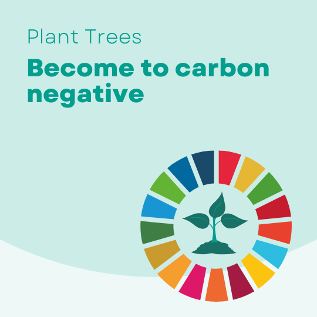

# 3. Solution

Sapling Network addresses the environmental challenges of blockchain through a **three-layered sustainability model**:

#### 1. **Radically Reduced Energy Consumption**

Sapling Network operates on Solana’s **Proof of History (PoH)** architecture, which eliminates the need for energy-intensive mining. Compared to Proof-of-Work systems:

* 1 Bitcoin transaction ≈ **4,000,000 Solana transactions**
* Energy per transaction:
  * BTC: **1943 kWh**
  * ETH: **192.45 kWh**
  * SOL: **0.00051 kWh**

This architectural choice enables Sapling Network to minimize emissions at the protocol level.

#### 2. **Renewable Energy Integration**

Sapling Network actively supports renewable energy initiatives by directing ecosystem fees and partnerships toward **solar and wind-based energy projects**, contributing to a cleaner blockchain infrastructure and aligning with global net-zero targets.

#### 3. **On-Chain Afforestation & Carbon Offsetting**

Sapling Network embeds **tree planting and ecosystem restoration** directly into its token economy. Through community participation and transparent verification platforms, real-world trees are planted to offset unavoidable emissions.

* Trees absorb approximately **26 tons of CO₂ per hectare per year**
* Long-term carbon sequestration creates sustained environmental impact
* Afforestation also restores biodiversity and local ecosystems

<figure><figcaption></figcaption></figure>
