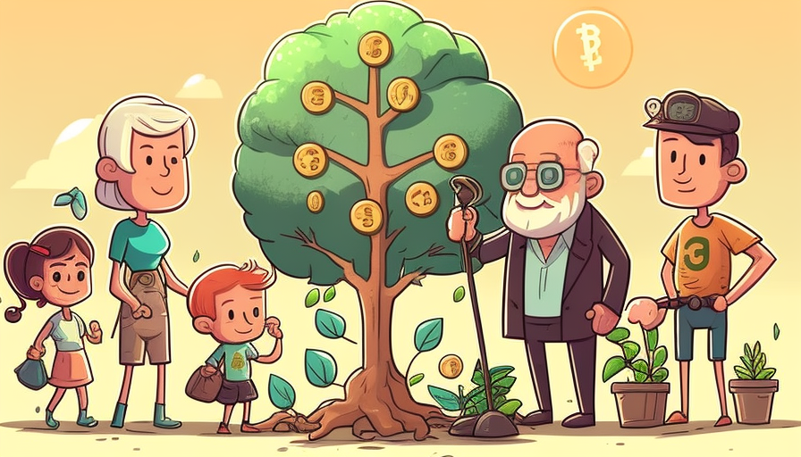

# Sapling Community

<figure><figcaption></figcaption></figure>

The Sapling Community is a platform established to encourage members to have a say in decision-making, participate in activities aimed at reducing carbon emissions, contribute to the development of the project and gain governance rights. The goal of the community is to create a sustainable future by reducing carbon footprint and promoting environmentally conscious practices.

#### Governance Structure

The Sapling Community operates on the principles of democratic governance, allowing members to make decisions together through voting and consensus building. Members are empowered to propose changes to the community's objectives and activities, and to participate in discussions and debates to reach a mutually acceptable solution. The community also has a transparent and accountable leadership structure, with regular elections and reporting mechanisms in place to ensure that all members have a voice and a stake in the decision-making process.

#### Activities and Contributions

The Sapling Community is dedicated to reducing carbon emissions and promoting sustainable practices. To achieve this goal, members can participate in various activities, such as tree planting, energy-efficient practices, and waste reduction initiatives. Additionally, members can contribute to the development of the project by sharing their expertise, resources, and knowledge. The community also encourages members to share their successes and lessons learned to inspire others to adopt sustainable practices.

#### Benefits of Membership:&#x20;

Members of the Sapling Community have a direct say in the decision-making process and are able to shape the direction of the project. They also have the opportunity to participate in activities aimed at reducing carbon emissions and contributing to a more sustainable future. In addition, members have access to a network of like-minded individuals and organizations, providing opportunities for collaboration and knowledge sharing.
